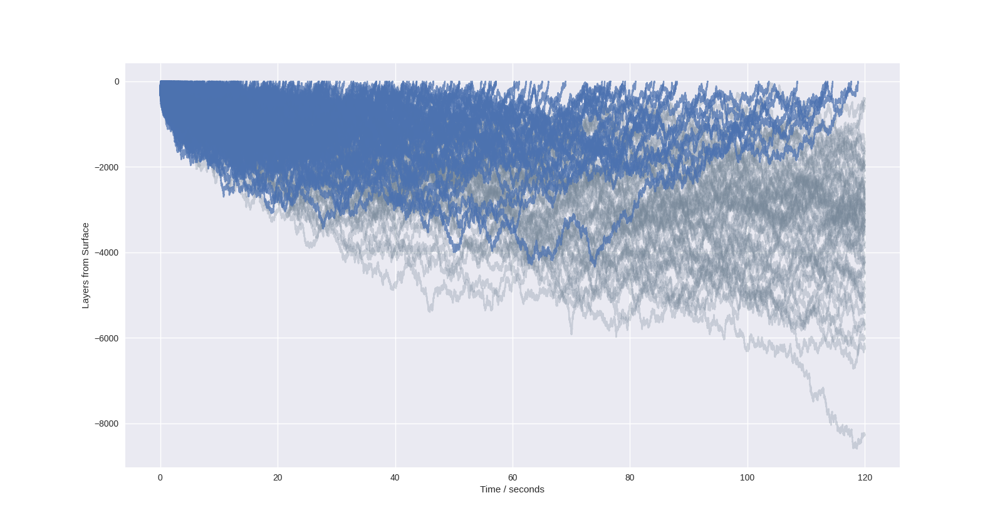

To compile the C code do `$ gcc -shared -o example.so -fPIC test.c`

It's interesting to note that even if a vacancy does not reach the surface, it will still be trapped in layers 3 and 4 indefinitely, maybe this would not produce a GR1 signal, making it effectively destroyed?
Starting at a depth of 218 layers (340-ish nm) beneath the surface, and running the simulation for 4 hours worth of migration at 800K, 1000K:
At 800K nothing reaches the surface, nor does anything even get close.

At 1000K 6003 out of 10,000 vacancies reach the surface, quite impressive.

When running at 1400K for only 20 minutes, out of 1000 vacancies are destroyed by reaching the surface, practically all of them!

### TODO:
* Make it so that the final image of the last neb is the initial image of the next neb, this will also fix any indexing issues.
* Write a quick function that just makes a vacancy in a given layer so that you could start the run from any height, 
will probably just have to start from the centre and then just recursively work your way up to the top.
* Currently there are fluctuations between layers that shouldn't be there, finite size effects?
